## Делай Jobs.
*Group:* ***CSSE-1804K***.
*Student:* ***Nurgazy Ermahan***.
*Discepline:* ***Web Technologies***

## Introduction.
Project "Делай JOBS" - a web application for finding vacancies, as well as specialists in the professional field "Information Technologies".

## Design. 
[Design of the project](https://www.figma.com/file/YFq56G3WJYpHIkATkzh3tmp9/Delay-Jobs?node-id=0%3A1)

## Pages.
- Main page
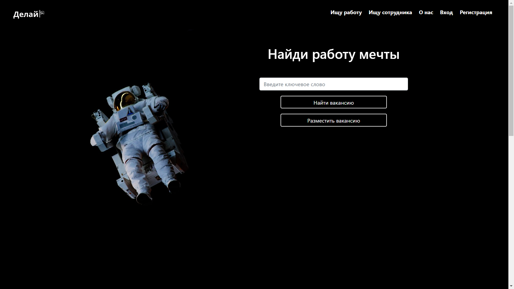
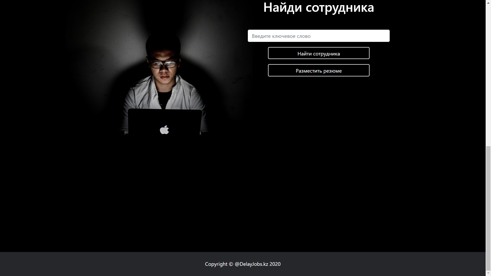
- Search Jobs
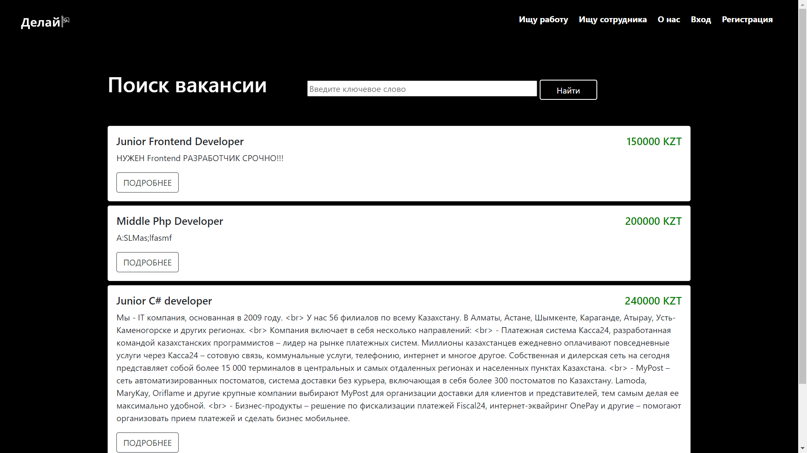
- Search Workers
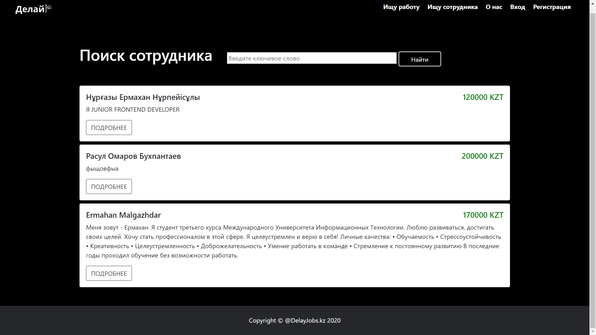
- Details Job
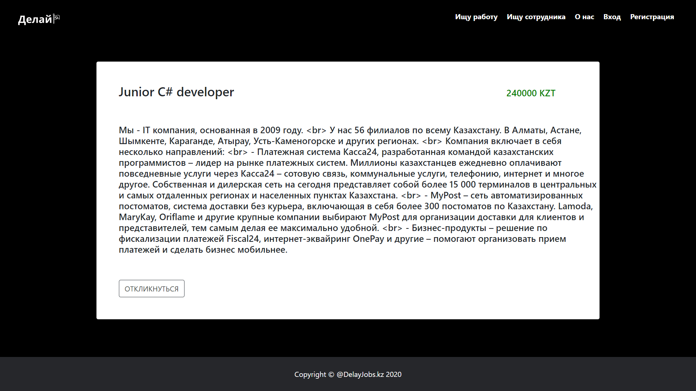
- Details Worker
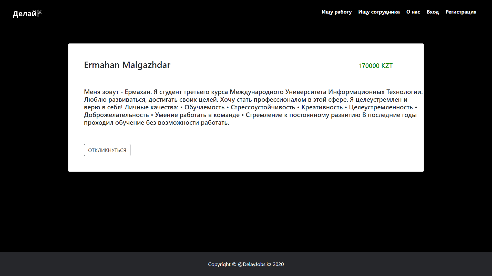
- Add Job
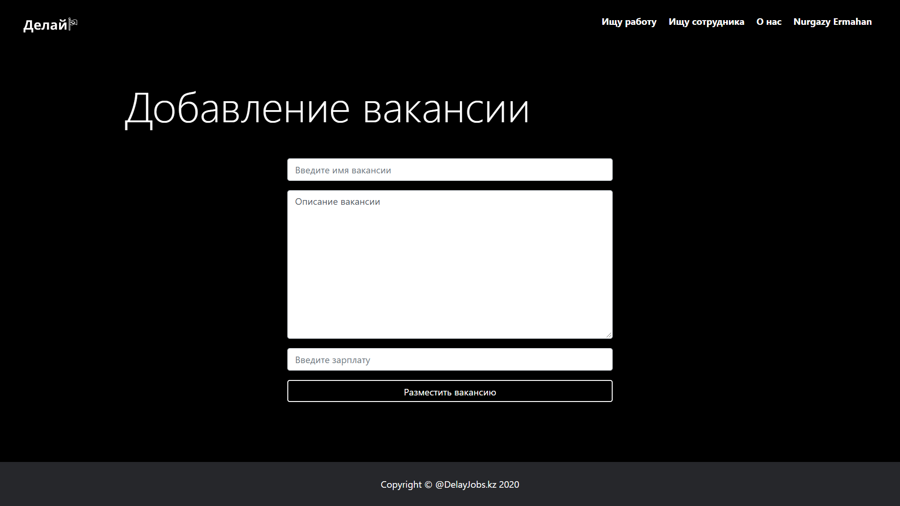
- Add Worker
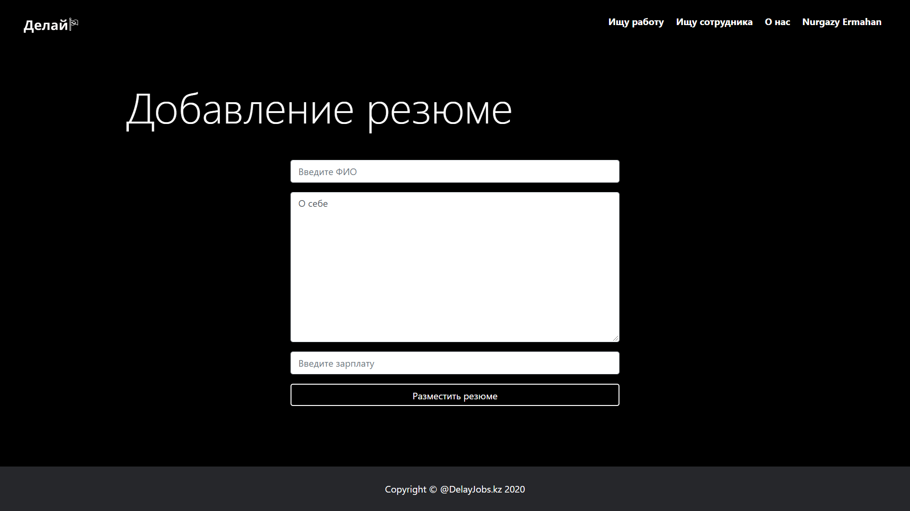
- Login page
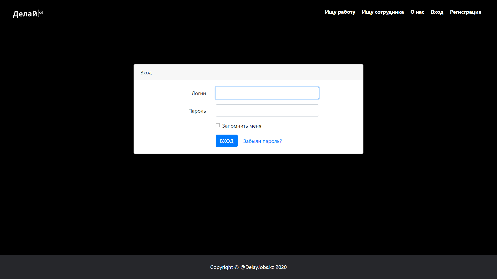
- Register page
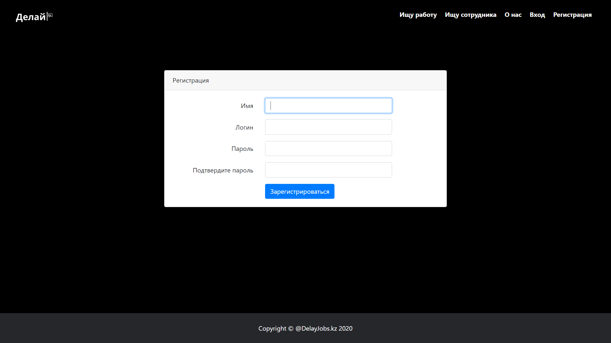
- Forget Password
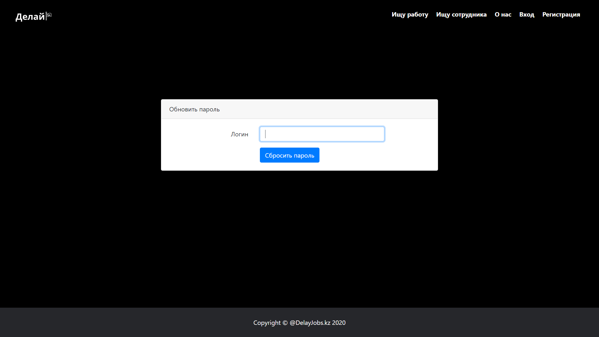
- Update Password
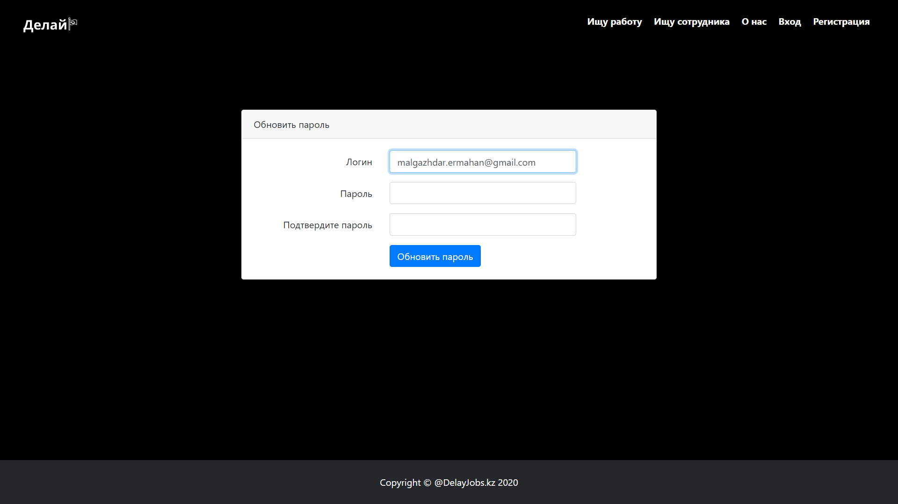
- After Authorization
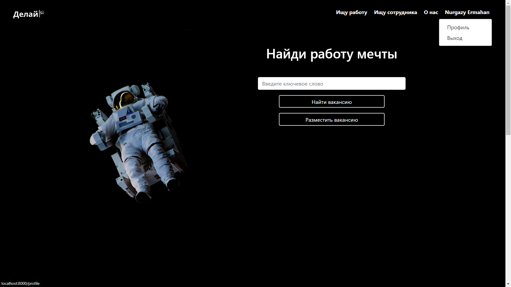
- Profile page
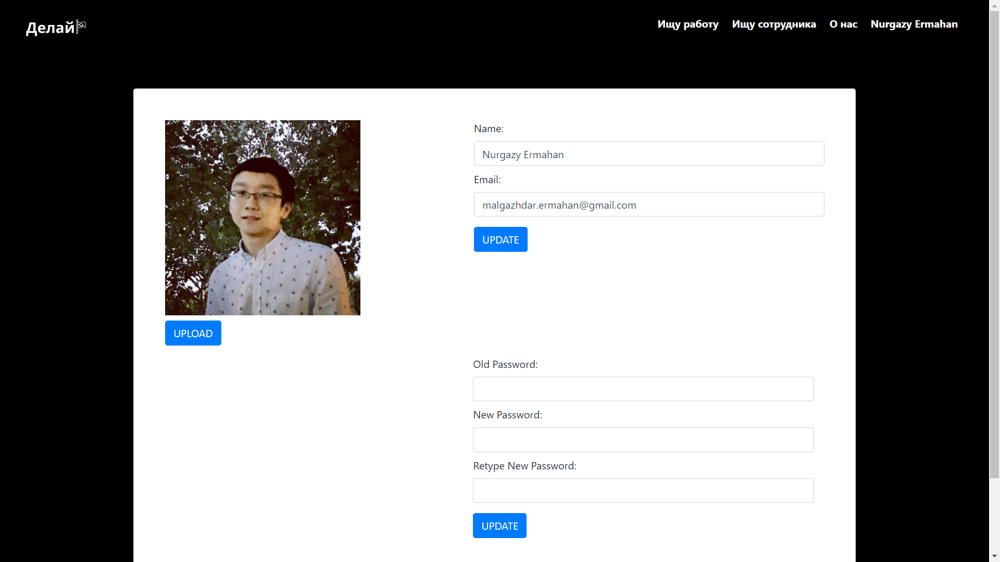